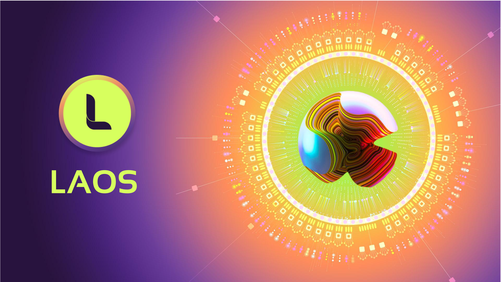

# The LAOS Chain

LAOS is the Universal layer 1 for digital assets across all blockchains, introducing unique features such as bridgeless minting and evolution. 



LAOS' main documentation can be found here:
- **[LAOS Whitepaper](https://github.com/freeverseio/laos-whitepaper/blob/main/laos.pdf)**, for an in-depth, fully detailed description.
- **[LAOS Developer Docs](https://docs.laosnetwork.io/)**, to start building your DApp using LAOS.
- **[LAOS Litepaper](https://laosnetwork.io/downloads/LAOS_litepaper.pdf)**, for a high-level, use case oriented description.

LAOS is fully open source and decentralized. The main code repositories are:

* **[The LAOS Parachain](#the-laos-parachain-monorepo)**. You are already in it. To streamline the development process and encourage diverse contributions, all core components of the Parachain were integrated in this single monorepo.

* **[The Universal Node](https://github.com/freeverseio/laos-universal-node)**. This node streamlines the integration process for DApps aiming to incorporate bridgeless minting and evolution across various chains, including Ethereum, by merely adjusting the RPC endpoint to connect to the relevant Universal Nodes.

* **[The Universal ERC721 Solidity Templates](https://github.com/freeverseio/laos-erc721)**. This template contains the minimal extensions of the ERC721 OpenZeppelin implementation that enables bridgeless minting and evolution in any EVM chain.

LAOS secured a slot as a Parachain in Polkadot after winning auction 68,
and LAOS Mainnet started producing blocks on July 3rd, 2024.

### LAOS Sigma Testnet

LAOS Sigma serves as the testnet for LAOS, currently maintained by the LAOS Foundation.
All development undergoes final testing in LAOS Sigma before being integrated in LAOS Mainnet.

You may use LAOS Sigma to test staking, or to develop and test your DApp, before launching to LAOS Mainnet.

* Testnet: **LAOS Sigma**
* Substrate RPC endpoint: [wss://rpc.laossigma.laosfoundation.io](https://polkadot.js.org/apps/?rpc=wss%3A%2F%2Frpc.laossigma.laosfoundation.io#/rpc)   
* EVM Public RPC endpoint: https://rpc.laossigma.laosfoundation.io
* EVM block explorer: https://sigma.explorer.laosnetwork.io/
* ParaId: 4006
* EVM Chain ID: 62850
* Chainlist Entry: https://chainlist.org/chain/62850

### LAOS Mainnet

LAOS Mainnet is secured by Polkadot's validators by being a Parachains since July 3rd, 2024.
Check [LAOS Roadmap](https://laosnetwork.io/roadmap-after-tge) for a list of features planned to be activated during the next months.

* Substrate RPC endpoint: [wss://rpc.laos.laosfoundation.io](https://polkadot.js.org/apps/?rpc=wss%3A%2F%2Frpc.laos.laosfoundation.io#/rpc)   
* ParaId: 3370
* EVM Chain ID: 6283
* Chainlist Entry: https://chainlist.org/chain/6283

## Running your own node

The quickest entry point to run your own LAOS Parachain node:
```
$ docker run freeverseio/laos-node:<release> --chain=<chain_name>
```
where:
* `<chain_name>` shall be set to `laos` or `laos-sigma` to operate on the mainnet /testnet, and
* `<release>` shall be chosen among the available releases published [here](https://github.com/freeverseio/laos/releases).

# Contributing

Contributions to the LAOS Parachain project are highly appreciated. Please adhere to [GitHub's contribution guidelines](https://docs.github.com/en/get-started/quickstart/contributing-to-projects) to ensure a smooth collaboration process.

For detailed implementation assistance, please engage with the development team on the official [LAOS Discord server](https://discord.gg/5YX9DHda).
